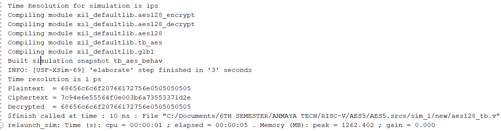
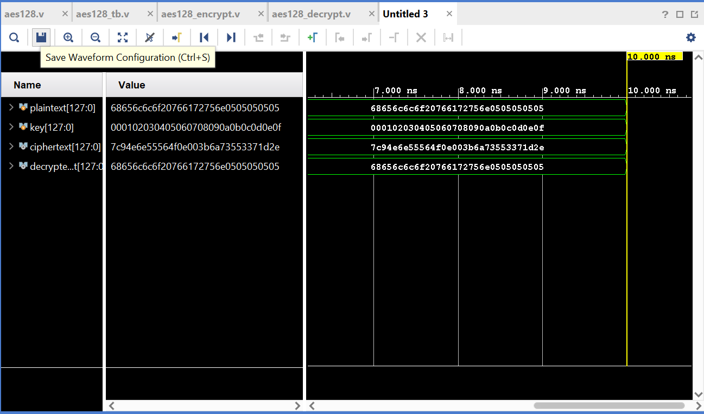

# AES-128 Hardware Encryption Engine

## Overview

This project implements an AES-128 (Advanced Encryption Standard) encryption engine using hardware design principles. The design focuses on achieving secure, fast, and efficient data encryption suitable for embedded systems and FPGA-based applications.

AES-128 operates on 128-bit data blocks with a 128-bit encryption key and performs 10 rounds of transformation to produce the final ciphertext.

---

## Features

- AES-128 encryption with 128-bit key support  
- Hardware-oriented modular design  
- High-speed and low-latency operation  
- Synthesizable and simulation-ready code  
- Suitable for FPGA and ASIC implementation  
- Scalable architecture for future extensions  

---

## AES-128 Algorithm

The AES-128 encryption process includes the following steps:

- Initial AddRoundKey  
- 9 Main Rounds:
  - SubBytes  
  - ShiftRows  
  - MixColumns  
  - AddRoundKey  
- Final Round:
  - SubBytes  
  - ShiftRows  
  - AddRoundKey  

---

## Architecture

The design is divided into the following modules:

- Top Module  
- Key Expansion Unit  
- SubBytes (S-Box) Module  
- ShiftRows Module  
- MixColumns Module  
- AddRoundKey Module  
- Control Unit / Finite State Machine  

---

## Design and Results

### Console Output

### Simulation Waveform

### Output Result

Example encryption result:

- Plaintext: `00112233445566778899aabbccddeeff`  
- Key: `000102030405060708090a0b0c0d0e0f`  
- Ciphertext: `69c4e0d86a7b0430d8cdb78070b4c55a`  

